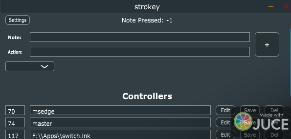

# strokey

## Description

This project is a C++ application built using JUCE that allows users to use a MIDI instrument or interface to trigger actions on their PC. It features a graphical user interface (GUI) and is highly configurable.

## Features

- MIDI instrument/interface integration
- Action triggering on the PC
- Graphical user interface (GUI)
- Configurability

## Installation

1. Clone the repository: `git clone https://github.com/your-username/your-repo.git`
2. Open the project in your preferred C++ IDE.
3. Build the project using the provided build tools.
4. Run the application on your PC.

## Usage

1. Connect your MIDI instrument or interface to your PC.
2. Launch the application.
3. Configure the desired actions and mappings in the GUI.
4. Start using your MIDI instrument/interface to trigger actions on your PC.

## Tips

1. If you want to controll the master volume write "master" in the action input.
2. If you want to controll the volum of a specific app write a bit of it's name in the action input. (Ex: Microsoft Edge -> msedge)
3. if you want to open a file write it's full path on the action input.

## Contributing

Contributions are welcome! If you would like to contribute to this project, please follow these steps:

1. Fork the repository.
2. Create a new branch: `git checkout -b feature/your-feature`
3. Make your changes and commit them: `git commit -m 'Add some feature'`
4. Push to the branch: `git push origin feature/your-feature`
5. Submit a pull request.

## License

This project is licensed under the [MIT License](LICENSE).
